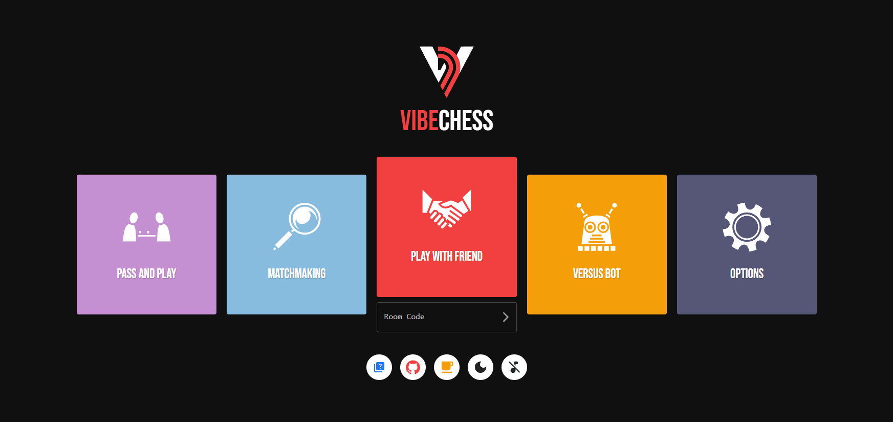

# <h1 align="center">ibeChess</h1>

<p align="center">
  
</p>

<p align="center">
  <a href="https://github.com/nathanielseth/VibeChess" target="_blank">VibeChess</a> is a free real-time online chess web app focused on quick and casual chess.
</p>

  <p align="center">
    <a href=""></a>
    <a href=""></a>
    <a href=""></a>
    <a href=""></a>
    <a href=""></a>
    <a href=""></a>
</p>

## Chess Dependencies

-   [chess.js](https://github.com/jhlywa/chess.js)
-   [react-chessboard](https://github.com/Clariity/react-chessboard)
-   [stockfish.js](https://github.com/nmrugg/stockfish.js)

# WIP Features

-   **Real-Time Games:** Play in real-time matches with friends or be paired with a random opponent through matchmaking.

-   **Play Against Computer:** Test your skills against Stockfish, the powerful computer chess engine.

-   **Live Chat:** Communicate with fellow users during games.

-   **More Features In Progress...**

# Setup

> Ensure you have installed [Node.js](https://nodejs.org/)

## Client

Install the dependencies:

```bash
npm install
```

Start the client (available at http://localhost:3000):

```bash
npm run dev
```

## Server

Navigate to the server directory:

```bash
cd server
```

Run the server (available at http://localhost:5000):

```bash
npm start
```

## Contributing

> This is my first react project, and I am still learning. That being said, any suggestions for improvements and contributions are welcome!

Before submitting a pull request, consider starting a discussion or opening an issue to discuss proposed changes.

### License

[MIT](./LICENSE)
