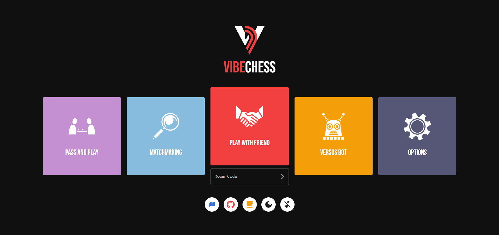

# <div style="text-align: center;">ibeChess</div>

<div style="text-align: center;">
    
    <p style="margin-top: 10px; max-width: 600px; margin-left: auto; margin-right: auto;">
        <a href="no link yet">
           VibeChess
        </a> is a free real-time online chess web app focused on quick and casual chess.
    </p>
</div>

  <p align="center">
    <a href=""></a>
    </a>
    <a href="">
    </a>
    <a href=""></a>
    <a href=""></a>
    <a href="">
    <a href=""></a>
</p>

### Features

-   **Real-Time Games:** Play in real-time matches with friends or be paired with a random opponent through matchmaking.

-   **Full Chess Experience:** Complete chess logic like en passant, pawn promotions, and smart handling of draws.

-   **Mini-Game:** Prior to a match, decide the playing color with a rock, paper, scissors mini-game.

-   **Live Chat:** Communicate with fellow users during games.

-   **More Features In Progress...**

## Setup

Ensure you have installed:

-   [Node.js](https://nodejs.org/)
-   [NPM](https://www.npmjs.com/)

### Running the App

To start the React app, run the following command:

```bash
npm run dev
```

Visit http://localhost:3000 in your browser.

## Contributing

> This is my first react project, and I am still learning. That being said, any suggestions for improvements and contributions are welcome!

Before submitting a pull request, consider starting a discussion or opening an issue to discuss proposed changes.

### License

[MIT](./LICENSE)
